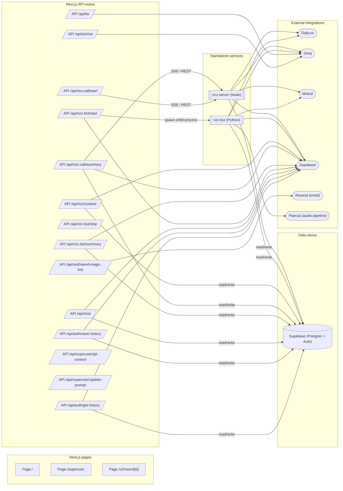

# Architecture map

**STATE: DRAFT. First pass for session 1.**

This map was produced by static introspection of the repository. It is the starting point for collaborative review. The final, labelled deliverable is produced together with Nick during the working sessions that make up Foundation Agreement Phase 1 Deliverable #1. Each node will be marked built / MVP / vision in those sessions.

## Diagram

## Legend

- Rounded shapes are external integrations.
- Cylinder shapes are data stores.
- Rectangles are Next.js pages.
- Trapezoid shapes are Next.js API routes.
- Double-bordered shapes are standalone services.

**Counts:** 32 nodes, 30 edges.

## Internal modules

- `app`: Next.js app-router root (pages, API routes, layouts)
- `src/components`: React components (UI + feature)
- `src/lib`: Library code (rizz prompts, supabase client, helpers)
- `src/hooks`: React hooks
- `src/types`: TypeScript types (incl. database types)
- `public`: Static assets

## External integrations (with evidence)

- **Daily.co**
  - root: dep `@daily-co/daily-react`
  - env `DAILY_API_KEY` referenced in render.yaml
- **Groq**
  - root: dep `groq-sdk`
  - rizz-server: dep `groq-sdk`
  - rizz-bot: dep `groq`
  - env `GROQ_API_KEY` referenced in render.yaml
- **Mistral**
  - rizz-server: dep `@mistralai/mistralai`
  - rizz-bot: dep `mistralai`
  - env `MISTRAL_API_KEY` referenced in render.yaml
- **Supabase**
  - root: dep `@supabase/supabase-js`
  - rizz-server: dep `@supabase/supabase-js`
  - rizz-bot: dep `supabase`
  - env `SUPABASE_URL` referenced in render.yaml
  - env `SUPABASE_SERVICE_KEY` referenced in render.yaml
  - env `NEXT_PUBLIC_SUPABASE_URL` referenced in rizz-bot/bot.py
- **Resend (email)**
  - root: dep `resend`
- **Pipecat (audio pipeline)**
  - rizz-bot: dep `pipecat-ai`

## Data stores (with evidence)

- **Supabase (Postgres + Auth)**
  - `app/api/auth/get-history/route.ts`
  - `app/api/auth/save-history/route.ts`
  - `app/api/chat/route.ts`
  - `app/api/rizz-bot/summary/route.ts`
  - `app/api/rizz-call/summary/route.js`

## What we couldn't infer

These are fork points and gaps that the script could not classify with confidence. Nick will clarify in session 1.

- Page `Page /` (app/page.tsx) has no externals or stores referenced inline. It may route everything through child components, or it may be scaffold from create-next-app. Confirm with Nick.
- Page `Page /superuser` (app/superuser/page.tsx) has no externals or stores referenced inline. It may route everything through child components, or it may be scaffold from create-next-app. Confirm with Nick.
- Page `Page /v2/room/[id]` (app/v2/room/[id]/page.tsx) has no externals or stores referenced inline. It may route everything through child components, or it may be scaffold from create-next-app. Confirm with Nick.
- Fork point: rizz-bot and rizz-server both exist. Confirm whether they are one logical component or two with distinct ownership.
- Could not find a magic-link auth flow surface (UI page). Is it missing, lives under a different path, or handled inline in the room page?
- Could not find a invite acceptance flow surface (UI page). Is it missing, lives under a different path, or handled inline in the room page?
- Could not find a post-call summary surface (UI page). Is it missing, lives under a different path, or handled inline in the room page?

## How to refine this draft

See `.nexflow/architecture-map/README.md` for the session-1 workflow that turns this draft into the final, labelled architecture map.
